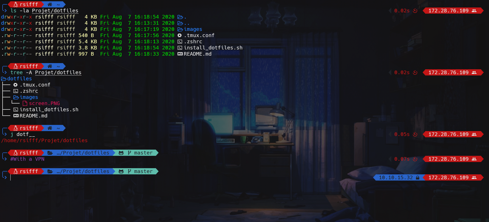

# Docker

This project was carried out to practice bash language and discover the docker environment.



## Plugins ZSH

- [thefuck](https://github.com/nvbn/thefuck)
- [zsh-syntax-highlighting](https://github.com/zsh-users/zsh-syntax-highlighting)
- [zsh-completions](https://github.com/zsh-users/zsh-completions)
- [zsh-autosuggestions](https://github.com/zsh-users/zsh-autosuggestions)
- [tmux](https://github.com/ohmyzsh/ohmyzsh/tree/master/plugins/tmux)
- [autojump](https://github.com/wting/autojump)
- [git](https://github.com/ohmyzsh/ohmyzsh/tree/master/plugins/git)

## Tools 

- [lolcat](https://github.com/busyloop/lolcat)
- [tmux](https://github.com/tmux/tmux/wiki)
- [lsd (LSDeluxe)](https://github.com/Peltoche/lsd)

## Installation

To install the docker, you have to use a user with admin rights.

```bash
sudo apt install docker.io 
wget https://raw.githubusercontent.com/Rsifff/docker/master/dockerfile 
sudo docker build -t dockerfile . 
sudo docker run -tid --name mondocker dockerfile:latest 
sudo docker exec -ti mondocker zsh
